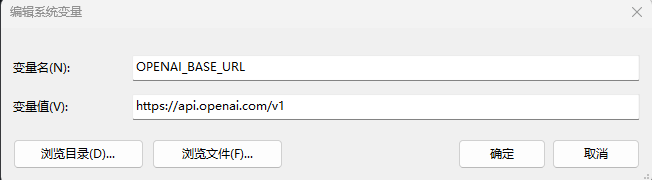
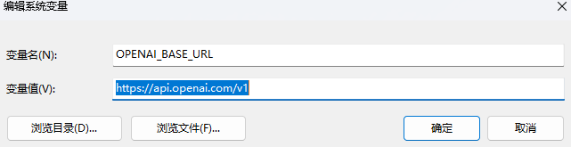

# codex-
解决codex reconnecting 最后抛出404 notfound error
## 问题原因
codex在下载时将环境量设置为OPENAI_BASE_URL=https://api.siliconflow.cn/v1
## 解决方法
将环境变量设置为OPENAI_BASE_URL=https://api.openai.com/v1
## 图片演示

  
  
找到环境变量

  
  
按照如图所示修改

